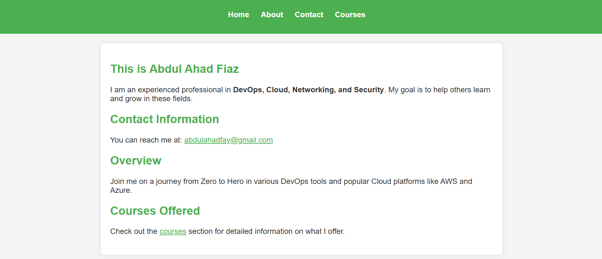

# Devopsified-go-Application
In this project, I set up a full DevOps pipeline for a Golang web application, automating deployment and management tasks. I containerized the app using a multi-stage Docker build to optimize its size and efficiency, then created Kubernetes manifests to define its deployment within a Kubernetes cluster. Using GitHub Actions for Continuous Integration (CI), I automated code testing and building, while Argo CD handled Continuous Delivery (CD), deploying updates to the cluster automatically.

To support multiple environments, I configured Helm charts, allowing smooth deployment across setups. The application is exposed using a NodePort service, and DNS mapping provides a user-friendly domain for easy access, creating a fully automated, scalable, and accessible deployment process.


## Running the server

To run the server, execute the following command:

```bash
go build -o mywebapp
./mywebapp
```

The server will start on port **8000**. You can access it by navigating to `http://localhost:8000/home` in your web browser.


=======
# go-web-application
A web application developed in Go (Golang) featuring static pages for user interaction. This project serves as a template for testing and deploying web applications. Easily clone, run, and customize to suit your needs!

**#Docker Support**
I have built a multi-stage Docker image for this Go application. If you prefer to use Docker, you can easily run it with the following command:
```bash
docker push meahad/go-web-application:latest
```

## Screenshot



Feel free to clone, run, and customize this project to suit your needs!


